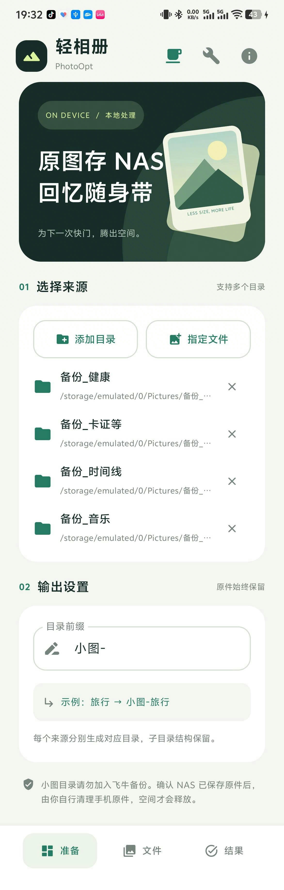
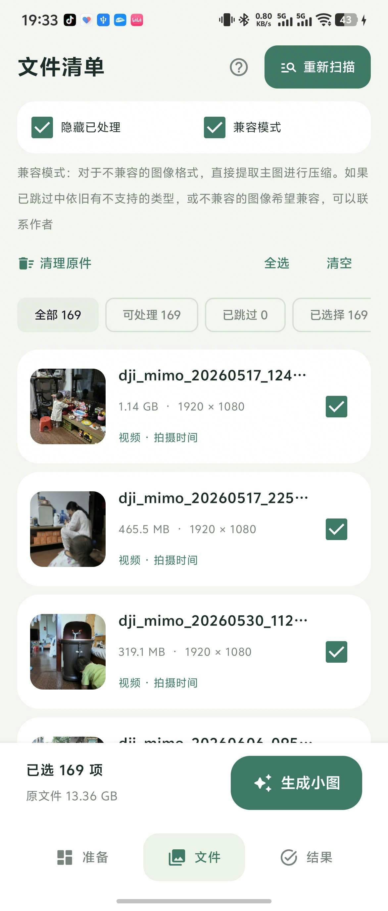

# 轻相册 · PhotoOpt

*原图存 NAS，回忆随身带。*

**照片备份到 NAS 后，手机里的原图依然占空间；删掉原图，又无法在系统相册里随时翻看。**

轻相册为已备份的照片与视频生成更小的本地副本，保留原有目录分类。确认备份和副本后，自行清理手机原件，就能让原图留在 NAS、轻量副本随身带。需要原图时，通过 NAS App 查看或下载。

**Android 12+ · 本地处理 · 无需登录 · 不申请网络权限 · 原件保留**

## 界面预览

点击缩略图查看原图。

| 准备：来源与画质 | 文件：扫描与选择 | 结果：任务记录 |
| :---: | :---: | :---: |
| <a href="docs/screenshots/prepare.png"></a> | <a href="docs/screenshots/files.png"></a> | <a href="docs/screenshots/tasks.png"></a> |

## 主要功能

- **照片与视频压缩**：提供「保留像素」「均衡」「更省空间」三档画质。
- **保留目录分类**：支持多个目录或指定文件，默认输出到同级的 `小图-原目录名`，保留子目录结构。
- **实况照片处理**：支持部分 vivo、Google 实况，可选择保留动态或只生成静态照片。
- **保护原件**：不覆盖已有输出、不自动删除原件，尽量保留拍摄时间、位置等信息。
- **任务记录**：查看处理结果、预览文件、导出 JSON；内置工具可检查文件处理标记。

## 快速使用

1. 用 NAS App 备份原件，确认备份可正常打开。
2. 在「准备」页添加目录或指定文件，选择画质（默认「更省空间」）。
3. 在「文件」页扫描，确认处理选项并勾选文件，点击「生成小图」。
4. 检查副本与任务结果，再自行清理已确认备份的手机原件。

输出示例：

```text
Pictures/备份-旅行/IMG_001.jpg
→ Pictures/小图-备份-旅行/IMG_001.jpg
```

## 我的最佳实践

**先分类，再备份，再生成小图，最后清理手机原件。**

1. **按用途建相册**：在系统相册中创建 `备份-时间线`、`备份-旅行`、`备份-家人` 等相册，确保它们对应实际文件目录。
2. **只备份原件目录**：在 NAS App 中选择这些 `备份-xxx` 目录，排除生成的 `小图-备份-xxx`。选择上层目录备份时，也要确认不会把小图一起上传。
3. **定期整理并等待备份**：把照片归入对应相册，确认 NAS 中的原件已备份完成且能正常打开。
4. **生成并检查小图**：用轻相册处理备份目录，检查副本画质、时间线和实况效果，并确认失败、跳过的文件。
5. **清理已确认的原件**：只删除已确认备份且副本符合预期的手机原件。如系统相册会隐藏空目录，可留一张照片保留相册入口。

如果 NAS App 开启了同步删除，先确认清理手机文件不会同时删除 NAS 原件；手机相册回收站也可能继续占用空间。

## 使用前留意

- **默认转静态**：「vivo实况图只保留照片」和「强制转普通图片」默认开启。希望保留已支持实况的动态时，取消前者；强制转换只提取静态主图。
- **生成副本不会立即释放空间**：原件和副本会同时存在；「累计压缩减少」是任务体积差，并非实际已释放空间。
- **并非所有文件都能处理**：普通 JPEG、静态 PNG/WebP 和符合条件的 SDR 视频可处理；Apple Live Photo、HEIC/RAW、HDR 视频等暂不支持，厂商实况兼容性因机型而异。请检查失败和跳过项。
- **小文件可能直接复制**：支持格式的小图片或压缩后未变小的文件会原样复制并写入处理标记；明确选择转静态的结果除外。
- **已有输出会跳过**：切换画质不会覆盖旧副本，可更换输出前缀比较效果。中断后重新扫描即可处理剩余文件。

## 本地构建

使用 **JDK 17、Android SDK Platform 35**，在 Android Studio 中打开项目并配置 SDK 路径，然后执行：

```sh
./gradlew :app:assembleDebug
```

Windows 使用 `gradlew.bat`。APK 位于 `app/build/outputs/apk/debug/app-debug.apk`；正式发布需自行配置签名。

## 反馈与支持

欢迎通过仓库 Issues 反馈，请附 App 版本、手机型号、处理选项和错误信息。分享任务报告前请移除私人路径等信息。

如果轻相册帮到了你，欢迎请我喝杯咖啡。打赏自愿，不影响任何功能。

<a href="app/src/main/assets/donation_qr.png"></a>

微信：`xk3440395`
