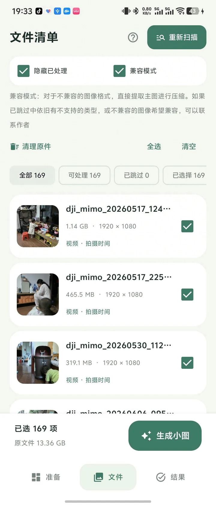
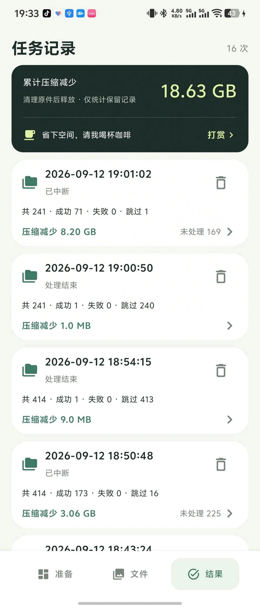
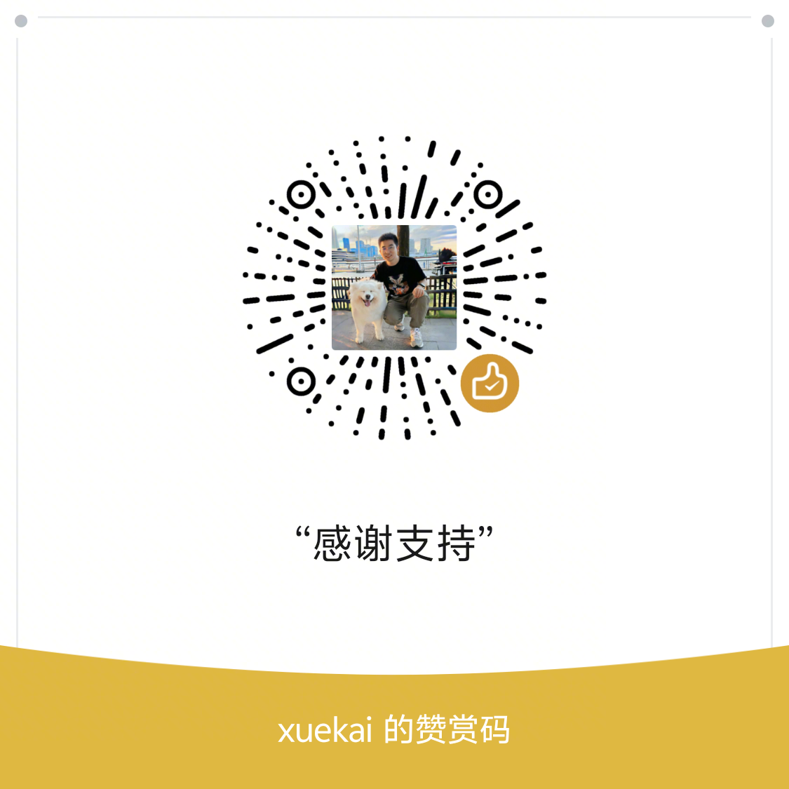

# 轻相册 · PhotoOpt

*原图存 NAS，回忆随身带。*

**照片备份到 NAS 后，手机里的原图依然占空间；删掉原图，又无法在系统相册里随时翻看。**

轻相册为已备份的照片与视频生成更省空间的本地小图，保留原有目录分类。确认备份和小图后，自行清理手机原件，就能让原图留在 NAS、小图随身带。需要原图时，通过 NAS App 查看或下载。

**Android 12+ · 本地处理 · 无需登录 · 不申请网络权限 · 原件保留**

## 界面预览

点击缩略图查看原图。文件页截图展示兼容模式开启的状态；当前版本默认关闭。

| 准备：来源与目录 | 文件：扫描与选择 | 结果：任务记录 |
| :---: | :---: | :---: |
| <a href="docs/screenshots/prepare.png"></a> | <a href="docs/screenshots/files.png"></a> | <a href="docs/screenshots/tasks.png"></a> |

## 主要功能

- **识别实际图片格式**：根据文件头识别 JPEG、PNG、WebP，支持扩展名与内容不一致的图片（例如 `.jpg` 实际为 PNG）。原样复制会校正扩展名，原文件不改名。
- **固定参数，直接压缩**：照片长边最多 1920、JPEG 质量 76；普通视频和 vivo 实况视频长边最多 1280、目标码率 1 Mbps，采用 H.264 / AAC。不会放大小图，实际体积随内容变化。已支持的 Google 单文件实况只压缩照片，内嵌视频原样保留。
- **保留目录分类**：支持多个目录或指定文件，默认输出到同级的 `小图-原目录名`，保留子目录结构。
- **实况照片处理**：支持部分 vivo、Google 实况，已支持的实况统一保留动态。
- **保护原件**：不覆盖已有输出，生成时不删除原件；可在确认 NAS 备份和小图后手动使用“清理原件”。尽量保留拍摄时间、位置等信息。
- **任务记录**：查看处理结果、预览文件、导出 JSON；内置工具可检查文件处理标记。

## 快速使用

1. 用 NAS App、百度网盘等软件备份原件，确认备份可正常打开。
2. 在「准备」页添加目录或指定文件，确认输出前缀。
3. 在「文件」页扫描，可处理的图片和视频默认全部选中；按需取消文件后，点击「生成小图」。
4. 检查备份、小图和任务结果，确认无误后可点击“清理原件”，查看清单并再次确认删除。

输出示例：

```text
Pictures/备份-旅行/IMG_001.jpg
→ Pictures/小图-备份-旅行/IMG_001.jpg
```

## 我的最佳实践

**先分类，再备份，再生成小图，最后清理手机原件。**

1. **按用途建相册**：在系统相册中创建 `备份-时间线`、`备份-旅行`、`备份-家人` 等相册，确保它们对应实际文件目录。
2. **只备份原件目录**：在 NAS App、百度网盘等备份软件中选择这些 `备份-xxx` 目录，排除生成的 `小图-备份-xxx`。选择上层目录备份时，也要确认不会把小图一起上传。
3. **定期整理并等待备份**：定期把需要备份的照片、视频移动到对应相册，让备份软件备份这些目录，确认 NAS 或网盘中的原件已备份完成且能正常打开。
4. **生成并检查小图**：备份成功后，用轻相册处理这几个原件目录；小图保存到独立的 `小图-原目录名` 相册/目录。检查小图画质、时间线和实况效果，并确认失败、跳过的文件。
5. **清理已确认的原件**：只删除已确认备份且小图符合预期的手机原件。如系统相册会隐藏空目录，可留一张照片保留相册入口。

如果 NAS App 开启了同步删除，先确认清理手机文件不会同时删除 NAS 原件；手机相册回收站也可能继续占用空间。

## 使用前留意

- **文件页两个选项**：「隐藏已处理」默认开启，「兼容模式」默认关闭，可按需切换。隐藏已处理不会影响“清理原件”的检查范围。
- **已支持实况保留动态**：不再提供实况仅照片选项；遇到部分不支持的图片时，可手动开启「兼容模式」提取静态主图；生成的小图不会保留这类文件的动态和附加信息，原件不变。
- **默认移除 HDR 增益图**：已支持的静态、实况照片输出均移除增益图，不设开关；保留实况动态时仍保留视频和配对信息。已有同名小图不会自动更新。
- **生成小图不会立即释放空间**：原件和小图会同时存在；「累计压缩减少」是任务体积差，并非实际已释放空间。
- **并非所有文件都能处理**：普通 JPEG、静态 PNG/WebP 和符合条件的 SDR 视频可处理；Apple Live Photo、HEIC/RAW、HDR 视频等暂不支持，厂商实况兼容性因机型而异。请检查失败和跳过项。
- **小文件可能直接复制**：支持格式的小图片或压缩后未变小的文件会原样复制并写入处理标记；明确选择转静态的结果除外。
- **已有输出会跳过**：新规则不会覆盖旧小图，可更换输出前缀比较效果。扫描时确认已有输出的文件不计入新任务总数和记录；生成途中发现同名输出时仍记为跳过。中断后重新扫描即可处理剩余文件。

## 手动清理原件

扫描后点击文件页“清理原件”，检查范围是本次扫描的全部来源，与文件勾选或隐藏状态无关。应用列出存在对应小图的候选原件、原件与小图路径及大小，并说明其他文件为何保留。用户必须确认 NAS 已备份完成、小图已检查可用，再点击“删除原件”。未确认不会删除。

删除前再次检查原件、小图是否仍为同一文件且大小/修改时间未变化；小图必须可读、非空，配对照片与视频必须都有小图。同一个小图对应多个原件、配对不完整、扫描后变动等情况保留原件。不读取 NAS，也不计算小图完整性哈希，备份状态与小图效果需用户确认。只删除明确列出的文件，不递归删除目录或小图；删除不会进入相册回收站。完成后显示删除、跳过和失败结果。若 NAS 使用同步删除模式，请先确认不会连带删除备份。

## 运维工具

准备页右上角点击扳手图标，可选择目录递归检查，或指定图片、视频，查看文件内是否有 PhotoOpt 处理标记。支持查看标记原文及压缩、复制、主图提取等处理方式，不修改文件。

工具区分“有标记”“未发现标记”“读取失败”和“暂不支持”。它不依赖任务记录；未发现标记也不代表文件从未处理过，其他软件可能移除了元数据。

## 反馈与支持

欢迎通过仓库 Issues 反馈，请附 App 版本、手机型号、处理选项和错误信息。分享任务报告前请移除私人路径等信息。

如果轻相册帮到了你，欢迎请我喝杯咖啡。打赏自愿，不影响任何功能。

<a href="app/src/main/assets/donation_qr.png"></a>

微信：`xk3440395`
